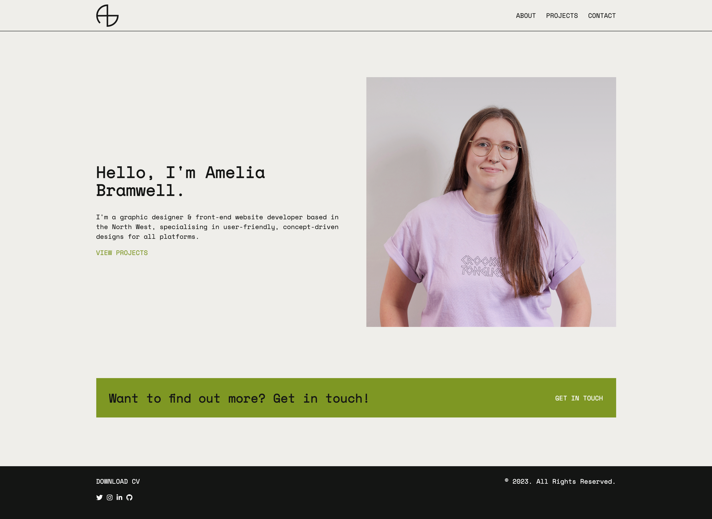

# Team React Portfolio

## Description

Week 13: Challenge 12 – React Portfolio

This portfolio is a web application built using the React JavaScript library. It showcases the work of Amelia Bramwell, a graphic designer and web developer based in the North West of England. The website collates her most recent projects, each with a direct link to the deployed project and GitHub Repository.

## Table of Contents

- [Installation](#installation)
- [Usage](#usage)
- [Contributing](#contributing)
- [Tests](#tests)
- [License](#license)

## Installation

View the repository on GitHub at https://github.com/Zwirled/react-portfolio/
And the generated team.html file on GitHub pages at https://zwirled.github.io/react-portfolio/

## Usage

To use this web application, please use the nav bar at the top of the page to navigate through the web pages.

## License

This project is licensed under the MIT license.

## Contributing

N/A

## Tests

N/A

## Questions

To visit my GitHub profile, please click here: https://github.com/Zwirled.

If you have any questions, please send them to bramwellamelia@gmail.com and I will get back to you as soon as I can.
